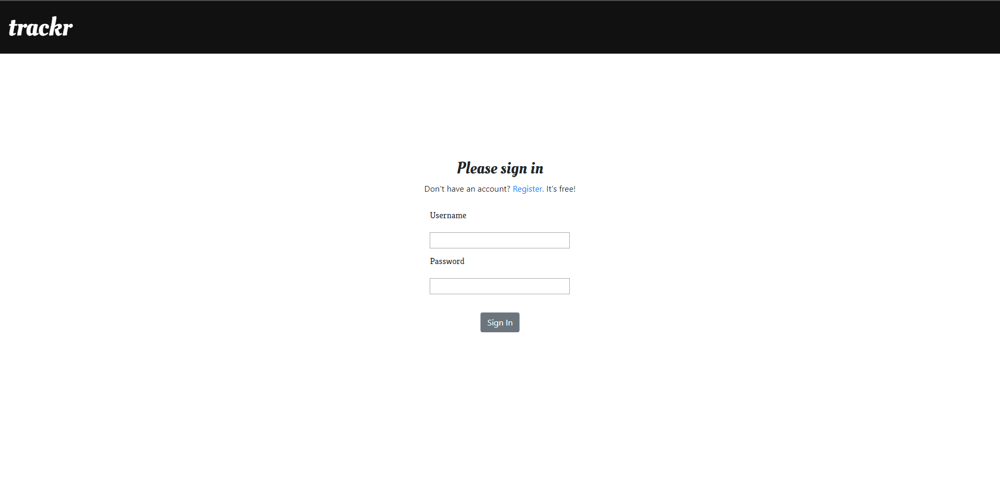
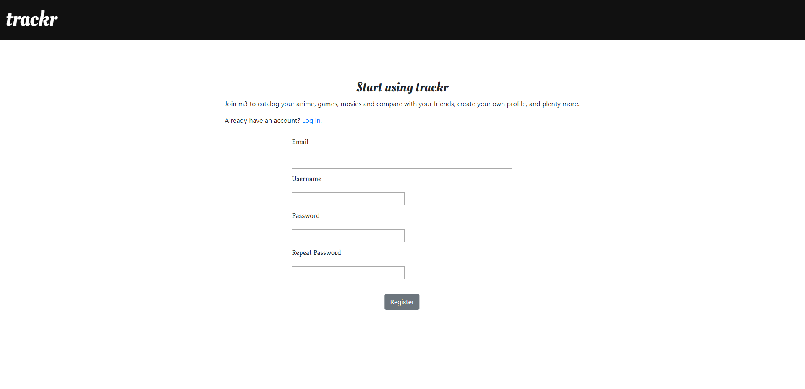
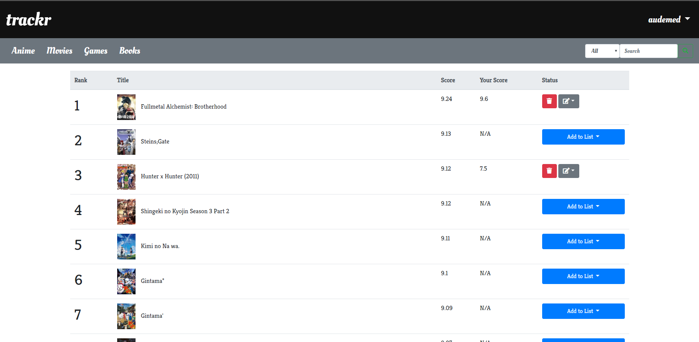
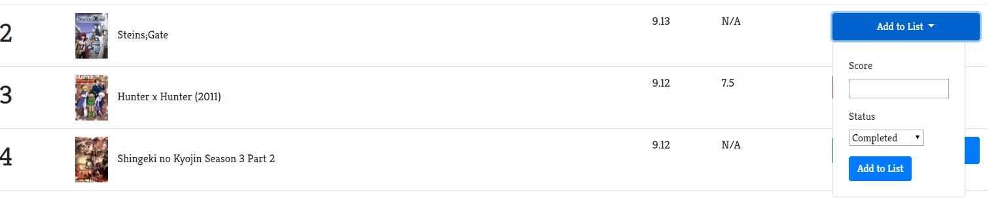
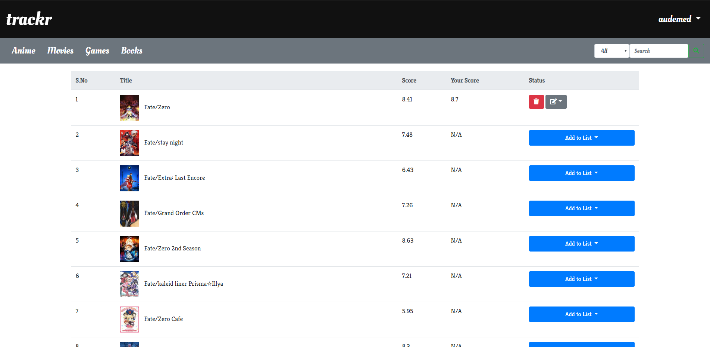
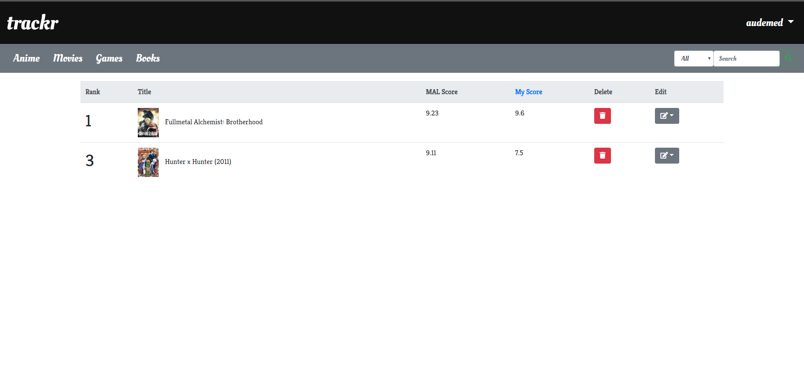
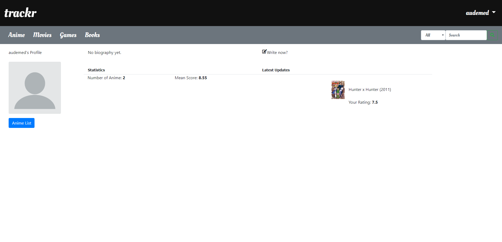

# Trackr

A hobby project aimed to solve my personal problem of losing track of the media I consume all combined in one place, which can be categorized into mostly four brackets: Anime, Movies/TV Shows, Books, Games. This project uses a multitude of API's available online for this tracking purpose (jikan-moe, omdb, igdb etc) and uses the data provided by them. 

(currently a long way away from completion, but approaching essential feature parity with its inspiration, MAL)

Made using Flask, a python micro web framework.

## Features

- Login/Register 
 
 
 
- Top Anime
 

- Add to List
 

- Search Anime
 

- Personal List
 

- Profile Page
 
